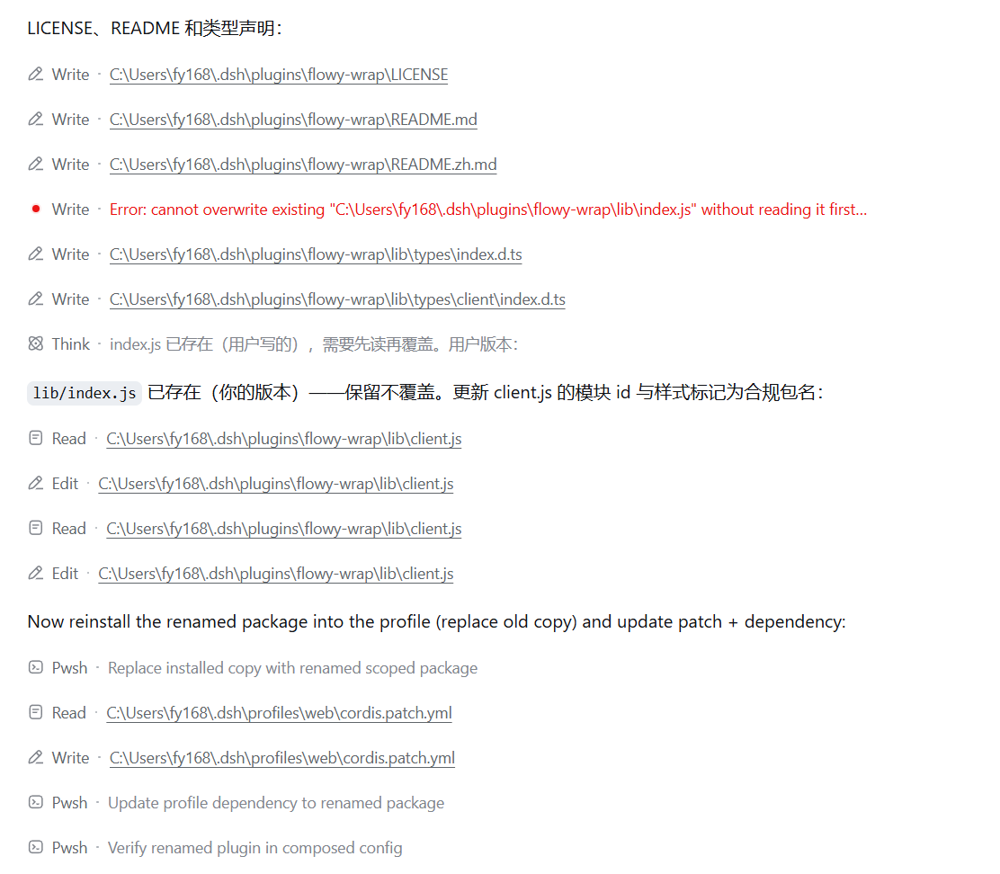
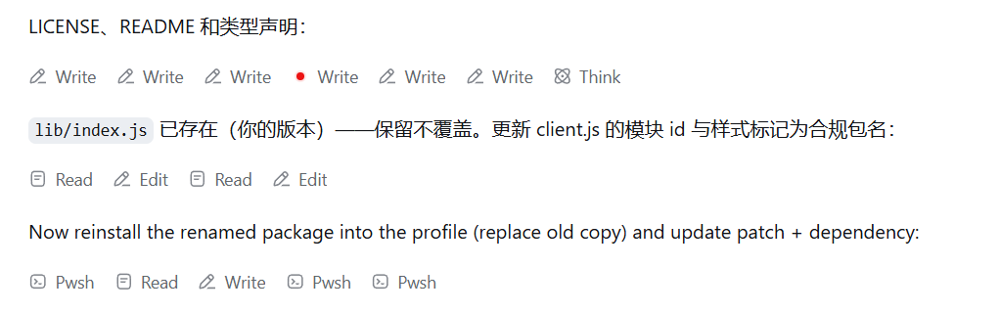

# dsh-chat-flow-re-layout

Client-side layout plugin for the DeepSeek Harness web UI: settled tool calls,
context injections and finished reasoning rows pile horizontally in the chat
flow as compact name-only chips, while running cards, streaming reasoning and
plain text keep their original full-width vertical stacking.

## Before / After

**Before** — every tool call and reasoning row takes its own full-width line:



**After** — settled rows pile horizontally as compact name-only chips, and the
same turn takes a fraction of the vertical space:



## How it works

Pure CSS injection, no component rewrites:

- the chat flow column is turned into a wrapping flex row;
- node kinds decide their own width: settled tool calls / context injections /
  reasoning rows become content-sized chips (`flex: 0 0 auto`), everything
  else stays a full-width line (`flex: 1 1 100%`);
- assistant-step internals are lifted into the flow with `display: contents`
  so reasoning rows can share lines with tool chips;
- the running turn-status strip (`role="status"`, "Deep diving...") always
  takes its own full line at the end of the flow;
- summary text is hidden on finished chips (class-suffix conventions
  `_summary` / `_separator` / `_sep` / `_fileLink`), restored with `:has()`
  for running and interactive Cordis cards.

## Layout

```
dsh-chat-flow-re-layout/
├── package.json          # dsh-chat-flow-re-layout
├── LICENSE               # MIT
├── lib/
│   ├── index.js          # Node half: empty plugin (ESM)
│   ├── client.js         # Browser half: ModuleLoader bundle, injects <style>
│   └── types/            # Type declarations for both halves
```

The browser half is a hand-written ModuleLoader bundle (no build step): the
stylesheet is injected into `<head>` when the module materializes and is
guarded by a `data-plugin-css` marker against double injection.

## Install

Clone this repository, then from the repository directory:

```sh
dsh plugin --profile web add .
```

Add a row to the profile's `cordis.patch.yml`:

```yaml
- insert:
    - id: chat-flow-re-layout
      name: 'dsh-chat-flow-re-layout'
```

then restart `dsh web`. Run `dsh --profile web --dump-config` to confirm the
plugin made it into the composed configuration. There is no build step — the
hand-written ModuleLoader bundle is committed as-is.
